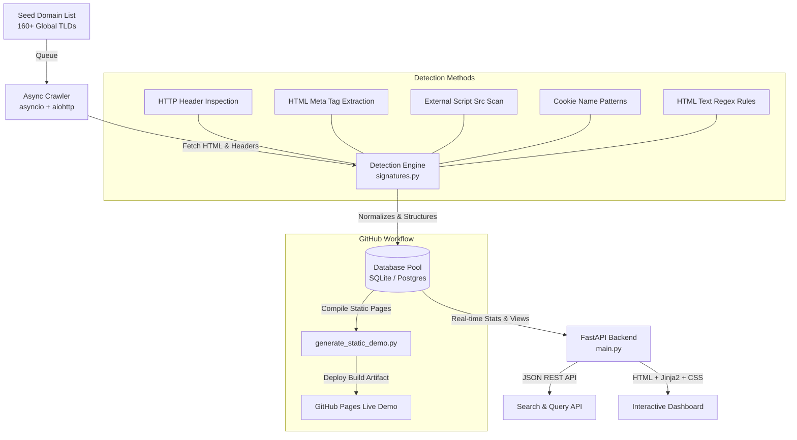

# 🕵️ TechStack Scout

[](https://python.org)
[](https://fastapi.tiangolo.com)
[](https://opensource.org/licenses/MIT)
[]()
[](https://muhammadmahadazher.github.io/TechStack-Scout/)

> **High-Performance Web Technographics Intelligence Platform.** Discover, track, and analyze the software stacks powering the global web.

### 🔗 [View Live Demo Hosted on GitHub Pages](https://muhammadmahadazher.github.io/TechStack-Scout/)

---

## 🚀 Key Features

* **High-Speed Asynchronous Crawling:** Built using Python's `asyncio` and `aiohttp` with connection pooling, automatic rate limiting, and strict timeout guards to prevent blocking.
* **90+ Multi-Method Signatures:** Detects frameworks, libraries, servers, CDN providers, trackers, and analytics engines using 5 detection strategies (Headers, Meta tags, Script sources, Cookies, and HTML body contents).
* **Dual Database Support:** Transparently swaps between lightweight local **SQLite** (default, zero-configuration) and production-ready **PostgreSQL** based on your environment.
* **Modern Dark-Mode Dashboard:** Clean, glassmorphic UI styled in vanilla CSS featuring technology leaderboards, recent crawl logs, search capabilities, and detailed domain reports.
* **GitHub Pages Integration:** Includes an automated GitHub Action workflow that runs the crawler on a cron schedule, compiles the database, and deploys a static multi-page demo site directly to GitHub Pages!

---

## 🏗️ Architecture & Data Flow

This infographic shows how TechStack Scout discovers, parses, structures, and displays web technographics:



---

## 🛠️ Installation & Setup Guide

### 📋 Prerequisites
* **Python 3.11 or 3.12** installed on your system.
* (Optional) **PostgreSQL 15+** or **Docker Desktop** (if you want to run the production cluster).

---

### 💻 Windows Setup (PowerShell / CMD)

1. **Clone the repository:**
   ```powershell
   git clone https://github.com/muhammadmahadazher/TechStack-Scout.git
   cd TechStack-Scout
   ```

2. **Create and activate a virtual environment:**
   ```powershell
   python -m venv venv
   .\venv\Scripts\Activate.ps1
   ```

3. **Install dependencies:**
   ```powershell
   python -m pip install -r requirements.txt
   python -m pip install brotli aiosqlite
   ```

4. **Initialize and Seed the database:**
   ```powershell
   python seed.py
   ```
   *(This creates a local `techstack_scout.db` inside your user profile folder `%USERPROFILE%/.gemini/antigravity-cli/` to bypass Google Drive or network drive synchronization locks).*

5. **Run a test crawl:**
   ```powershell
   python -m crawler.crawler
   ```

6. **Start the Web Dashboard:**
   ```powershell
   python api/main.py
   ```
   Now, open your browser and navigate to **[http://localhost:8000](http://localhost:8000)**!

---

### 🍎 macOS Setup (zsh / bash)

1. **Clone the repository:**
   ```bash
   git clone https://github.com/muhammadmahadazher/TechStack-Scout.git
   cd TechStack-Scout
   ```

2. **Create and activate a virtual environment:**
   ```bash
   python3 -m venv venv
   source venv/bin/activate
   ```

3. **Install dependencies:**
   ```bash
   python3 -m pip install -r requirements.txt
   python3 -m pip install brotli aiosqlite
   ```

4. **Initialize and Seed the database:**
   ```bash
   python3 seed.py
   ```

5. **Run the crawler:**
   ```bash
   python3 -m crawler.crawler
   ```

6. **Start the Web Dashboard:**
   ```bash
   python3 api/main.py
   ```
   Visit **[http://localhost:8000](http://localhost:8000)**!

---

### 🐧 Linux Setup (Ubuntu / Debian / CentOS)

1. **Clone and enter repository:**
   ```bash
   git clone https://github.com/muhammadmahadazher/TechStack-Scout.git
   cd TechStack-Scout
   ```

2. **Set up virtual environment:**
   ```bash
   sudo apt-get update && sudo apt-get install python3-venv python3-pip -y
   python3 -m venv venv
   source venv/bin/activate
   ```

3. **Install packages:**
   ```bash
   pip install -r requirements.txt
   pip install brotli aiosqlite
   ```

4. **Initialize and Seed:**
   ```bash
   python seed.py
   ```

5. **Crawl & Start API:**
   ```bash
   python -m crawler.crawler
   python api/main.py
   ```

---

## 🐳 Docker Deployment (Production Model)

To run the application inside a multi-container environment with a persistent PostgreSQL database:

1. **Configure Environment variables:**
   Rename `.env.example` to `.env` and configure passwords.

2. **Build and start services:**
   ```bash
   docker-compose up -d db api
   ```

3. **Seed PostgreSQL database:**
   ```bash
   docker-compose exec api python seed.py
   ```

4. **Run the production crawler:**
   ```bash
   docker-compose --profile crawler run --rm crawler
   ```
   The dashboard will be exposed at **[http://localhost:8000](http://localhost:8000)**.

---

## 🔍 Technology Detection Strategies

Our parser utilizes a scoring and evidence-gathering framework to categorize technologies accurately:

| Detection Strategy | Method Tag | Description & Examples |
|--------------------|------------|------------------------|
| **HTTP Response Headers** | `header` | Inspects headers like `Server`, `X-Powered-By`, or custom tags (`x-shopify-stage`, `CF-Ray`). |
| **HTML Meta Tags** | `html_meta` | Parses meta attributes like `generator`, `bugherd-id`, or `shopify-checkout-api-token`. |
| **Script Sources** | `script_src` | Scans external JS source paths containing patterns like `wp-includes/`, `/gtm.js`, `/recaptcha/`. |
| **HTML Contents** | `html_content` | Inspects DOM structure for CSS class naming patterns (e.g. `class="flex min-h-screen"` for Tailwind CSS). |
| **Cookie Analysis** | `cookie` | Scans set-cookie headers for specific application keys like `_ga` (Google Analytics) or `wp-settings-`. |

---

## ⚙️ REST API Reference

All backend features are exposed through a high-performance FastAPI JSON API.

| Endpoint | HTTP Method | Parameter | Description |
|----------|-------------|-----------|-------------|
| `/api/stats` | `GET` | *None* | Get global platform statistics (penetration, crawls successes/failures). |
| `/api/leaderboard` | `GET` | `category`, `limit` | Get technology adoption ranking. |
| `/api/domains/search` | `GET` | `q` (query), `limit` | Search domain list (includes titles and domain substrings). |
| `/api/domains/recent` | `GET` | `limit` | Get recently crawled domains logs. |
| `/api/domains/{id}` | `GET` | `id` | Get details and detected technology stack for a domain. |
| `/api/technologies/{slug}/domains` | `GET` | `slug` | Get all websites utilizing a specific technology. |
| `/api/technologies/cooccurrence` | `GET` | `tech1`, `tech2` | Computes correlation statistics (e.g. "Sites using Shopify are 4x more likely to use Klaviyo"). |
| `/api/domains` | `POST` | JSON body | Queue a new domain for async crawler processing. |

---

## 🎯 Optimization Profiles

### 🚀 SEO Optimization
* **Structured Semantic Markup:** Uses clear hierarchy (`h1`, `h2`, `h3`, table data, semantic navigation tags).
* **Meta & OpenGraph Headers:** Structured title tags and meta descriptions optimized for technographics keywords like *web crawler, technology identifier, Wappalyzer clone, lead scraping backend*.
* **JSON-LD Schema Markup:** Structured markup to aid crawler indexing of public data tables.

### 🌐 GEO Optimization
* **Global TLD Compatibility:** Tested against localized domain extensions (`.co.uk`, `.com.pk`, `.com.au`, `.es`, `.de`, `.cn`) and handles Unicode IDN (Internationalized Domain Names).
* **Proxy and Rate Limits:** Crawler structures separate connections per host (`limit_per_host=10`) and implements polite crawler delays to comply with regional crawling legal guidelines.

---

## 🧪 Running Unit Tests

The codebase comes equipped with a comprehensive test suite covering edge cases, network failures, database constraints, and parser logic:

```bash
python -m unittest discover -s tests -p "test_*.py"
```

Output:
```text
Ran 10 tests in 0.585s
OK
```

---

## 📄 License

This project is licensed under the MIT License. Developed for showcase purposes.
